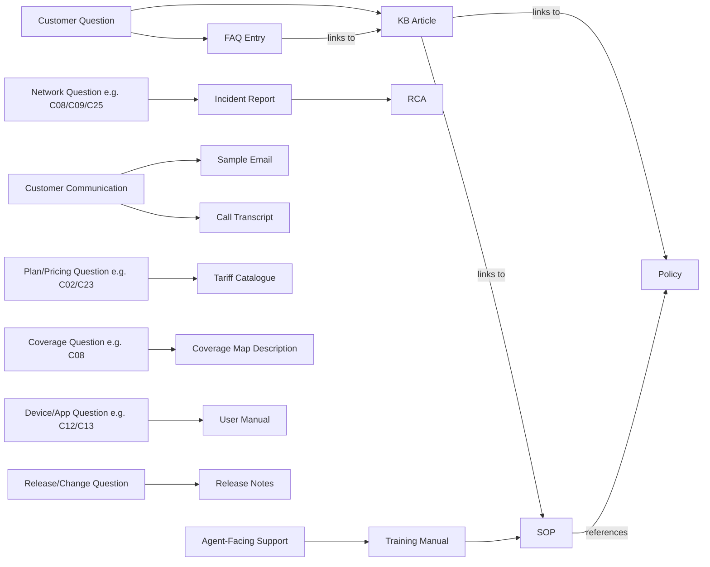

# Question Category → Document Type Mapping

This diagram illustrates how a customer question in a given category is typically supported by the different document types generated in this knowledge base.

## Category-Level Coverage Summary

| Category | Name | Primary Document Types |
|---|---|---|
| C01 | Account Management | FAQ, KB |
| C02 | Plans & Subscriptions | FAQ, KB, Policy, Tariff |
| C03 | Recharge & Payments | FAQ, KB, SOP, Transcript, Email |
| C04 | Billing & Invoices | FAQ, KB, Policy, Incident |
| C05 | SIM Card Services | FAQ, KB, SOP |
| C06 | Number Portability (MNP) | FAQ, KB, Transcript, Email |
| C07 | Roaming | FAQ, KB, Incident |
| C08 | Network Coverage & Outages | FAQ, KB, SOP, Incident, RCA, Coverage Map, Training |
| C09 | Data Services & Speed | FAQ, KB, Incident, Transcript, Email |
| C10 | Value Added Services (VAS) | FAQ, SOP, Training |
| C11 | International Calling & SMS | FAQ |
| C12 | Device Compatibility | FAQ, Manual |
| C13 | App & Self-Care Portal | FAQ, KB, SOP, Incident, RCA, Manual |
| C14 | Offers & Promotions | FAQ, Email |
| C15 | Loyalty & Rewards | FAQ |
| C16 | Complaints & Grievances | FAQ, KB, SOP, Transcript, Email |
| C17 | KYC & Identity Verification | FAQ, KB, SOP, Policy, Training, Transcript, Email |
| C18 | Security & Fraud | FAQ, KB, SOP, Policy, Training, Incident, RCA, Transcript, Email |
| C19 | Privacy & Data Protection | FAQ, KB, Policy |
| C20 | Refunds & Adjustments | FAQ, KB, SOP, Policy |
| C21 | Termination & Deactivation | FAQ, KB, SOP, Transcript, Email |
| C22 | New Connection Activation | FAQ, KB, SOP |
| C23 | Enterprise & Business Services | FAQ, KB, Policy, Tariff |
| C24 | IoT & M2M Services | FAQ, Manual |
| C25 | Broadband & FTTH Services | FAQ, KB, SOP, Incident, RCA, Manual, Transcript, Email |
| C26 | DND & Spam Management | FAQ, KB |
| C27 | Accessibility Services | FAQ |
| C28 | Regulatory & Compliance (TRAI) | FAQ, KB, Policy |
| C29 | Technical Support & Troubleshooting | FAQ, KB, Manual |
