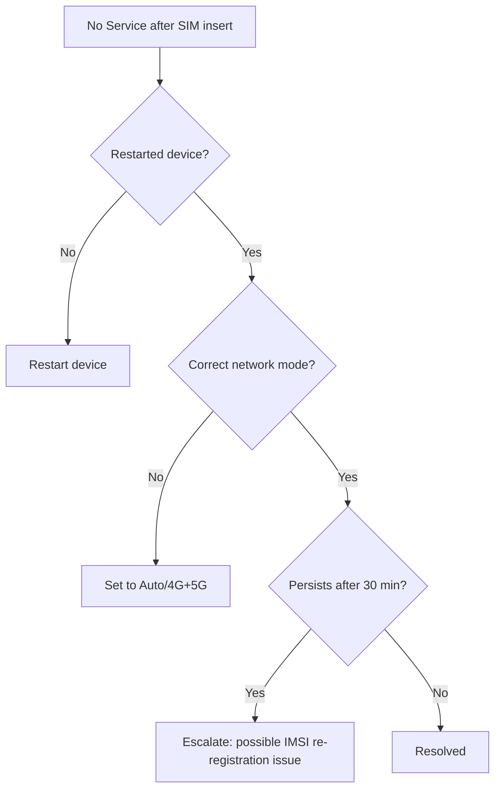

# Diagnosing 'No Service' After a SIM Swap

**Document ID:** KB_C05_sim_swap_troubleshooting  
**Category:** C05 — SIM Card Services  
**Department:** Customer Care  
**Last Updated:** 2026-08-06  
**Version:** 1.0  
**Source Authority:** Internal Knowledge Base

---

## Purpose

Step-by-step diagnostic flow for a SIM that shows no network after insertion.

## Diagnostic Flow

## When to Escalate

If the flow reaches step G, log a ticket per SOP_C05_SIM_REPLACEMENT and flag for provisioning-team review.